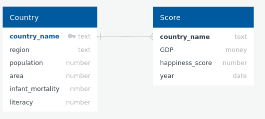

# happiness-report
DB report with world happiness dataset

The project directory is organized in folder concerning each topic of the report.

/datasets -> for the raw datasets to work with

/modelling -> for the modelling exercise

/python -> for the python scripts exercises

/database -> for the database exercise

/outputs -> for the extra exercise outputs

# 1) Download Files.
a) Download the world-happiness dataset from here. Save the five files (one per year
as "wh-2015.csv, wh-2016.csv, wh-2017.csv, wh-2018.csv, wh-2019.csv"). This
dataset contains results from a world annual survey about the state of global
happiness.

b) Download the countries-of-the-world ("countries of the world.csv") dataset from here.
This dataset has static data about the population, area, coastline, migration, infant
mortality, GDP, and literacy.

# Modelling Exercise
a) Draw a UML diagram of a database capable of holding data about each country’s
population, area, infant mortality, GDP, and literacy, and the score column of the
world-happiness (uml.png).

b) Convert this diagram into the relational model (relational.txt).

c) Write a SQL script that creates the database (happiness.sql).

d) Create the corresponding tables in your PostgreSQL database.

# 3) Prepare Data.
a) You noticed that some countries do not have the same name in both datasets. Write
a Python script (compare-countries.py) that reads the world-happiness dataset files
and compares each country's name against the countries-of-the-world dataset. If a
country in the world-happiness dataset does not exist in the countries-of-the-world
dataset, write that country to the console to be corrected/removed (manually or using
another Python script).

# 4) Load Data.
a) Create a Python script (load_countries_of_the_world.py) that:

    i) removes all data from the database (using the DELETE command),

    ii) reads the countries of the world.csv file, and

    iii) populates the database with new data (using the INSERT command).

b) Create a Python script (load_happiness.py) that:

    i) removes all happiness data from the database for a certain year (passed as an argument)
    
    ii) reads data from one of the world-happiness datasets files (passed as an argument), and
    
    iii) populates the database with data from that file and year.